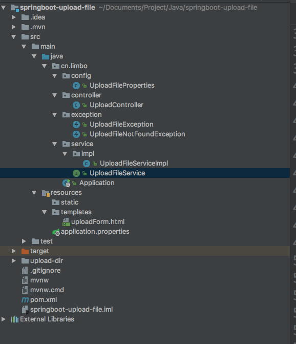

# springboot 上传文件

看了官网的的上传文件的例子，自己照着也做了一下

项目的结构还是很清楚的，大致如下：



exception包下主要是一些自定义的异常，很简单，就不阐述了

用了thymeleaf做html的渲染，所以在template下有一个uploadForm.html

config包下是关于上传上来的文件存放文件的相关设定，比较简单，也不阐述了

主要说说controller和service吧

controller代码：

```java
package cn.limbo.controller;

import cn.limbo.exception.UploadFileNotFoundException;
import cn.limbo.service.UploadFileService;
import org.springframework.beans.factory.annotation.Autowired;
import org.springframework.core.io.Resource;
import org.springframework.http.HttpHeaders;
import org.springframework.http.ResponseEntity;
import org.springframework.stereotype.Controller;
import org.springframework.ui.Model;
import org.springframework.web.bind.annotation.*;
import org.springframework.web.multipart.MultipartFile;
import org.springframework.web.servlet.mvc.method.annotation.MvcUriComponentsBuilder;
import org.springframework.web.servlet.mvc.support.RedirectAttributes;

import java.io.IOException;
import java.util.stream.Collectors;

/**
 * Created by limbo on 2017/5/11.
 */
@Controller
public class UploadController {


	private final UploadFileService service;

	@Autowired
	public UploadController(UploadFileService service){
		this.service = service;
	}

	@GetMapping("/")
	public String listUploadFiles(Model model) throws IOException{
		model.addAttribute("files",service
				.loadAll()
		        .map(path -> MvcUriComponentsBuilder
		                            .fromMethodName(UploadController.class,"serveFile",path.getFileName().toString())
		                            .build().toString())
		        .collect(Collectors.toList()));
		return "uploadForm";
	}

	@GetMapping("/files/{filename:.+}")
	@ResponseBody
	public ResponseEntity<Resource> serveFile(@PathVariable String filename){
		Resource file = service.loadAsResource(filename);
		return ResponseEntity
				.ok()
				.header(HttpHeaders.CONTENT_DISPOSITION, "attachment; filename=\""+file.getFilename()+"\"")
				.body(file);
	}

	@PostMapping("/")
	public String handleFileUpload(@RequestParam("file")MultipartFile file, RedirectAttributes redirectAttributes){
		service.upload(file);
		redirectAttributes.addFlashAttribute("message","You successfully uploaded " + file.getOriginalFilename() + "!");
		return "redirect:/";
	}

	@ExceptionHandler(UploadFileNotFoundException.class)
	public ResponseEntity handleUploadFileNotFound(UploadFileNotFoundException e){
		return ResponseEntity.notFound().build();
	}
}

```

这个类通过@Controller注解，表明自己上一个Spring MVC的C。每个方法通过 
@GetMapping 或者@PostMapping注解表明自己的 http方法。

- GET / 获取已经上传的文件列表
- GET /files/{filename} 下载已经存在于服务器的文件
- POST / 上传文件给服务器

直接给上service的实现类

```java
package cn.limbo.service.impl;

import cn.limbo.config.UploadFileProperties;
import cn.limbo.exception.UploadFileException;
import cn.limbo.exception.UploadFileNotFoundException;
import cn.limbo.service.UploadFileService;
import org.springframework.beans.factory.annotation.Autowired;
import org.springframework.core.io.Resource;
import org.springframework.core.io.UrlResource;
import org.springframework.stereotype.Service;
import org.springframework.util.FileSystemUtils;
import org.springframework.web.multipart.MultipartFile;

import java.io.IOException;
import java.net.MalformedURLException;
import java.nio.file.Files;
import java.nio.file.Path;
import java.nio.file.Paths;
import java.util.stream.Stream;

/**
 * Created by limbo on 2017/5/11.
 */
@Service
public class UploadFileServiceImpl implements UploadFileService {

   private final Path rootLocation;

   @Autowired
   public UploadFileServiceImpl(UploadFileProperties properties) {
      this.rootLocation = Paths.get(properties.getLocation());
   }

   @Override
   public void init() {
      try{
         Files.createDirectory(rootLocation);
      }catch (IOException e){
         throw new UploadFileException("Could not initialize upload",e);
      }
   }

   @Override
   public void upload(MultipartFile file) {

      try {
         if (file.isEmpty()) {
            throw new UploadFileException("Failed to upload empty file" + file.getOriginalFilename());
         }
         Files.copy(file.getInputStream(), this.rootLocation.resolve(file.getOriginalFilename()));
      } catch (IOException e) {
         throw new UploadFileException("Failed to up load file" + file.getOriginalFilename(), e);
      }

   }

   @Override
   public Stream<Path> loadAll() {

      try {
         return Files.walk(this.rootLocation, 1)
               .filter(path -> !path.equals(this.rootLocation))
               .map(path -> this.rootLocation.relativize(path));
      } catch (IOException e) {
         throw new UploadFileException("Failed to read upload files", e);
      }

   }

   @Override
   public Path load(String filename) {
      return rootLocation.resolve(filename);
   }

   @Override
   public Resource loadAsResource(String filename) {
      try {
         Path file = load(filename);
         Resource resource = new UrlResource(file.toUri());
         if (resource.exists() || resource.isReadable()) {
            return resource;
         } else {
            throw new UploadFileNotFoundException("Could not read file: " + filename);
         }
      } catch (MalformedURLException e) {
         throw new UploadFileNotFoundException("Could not read file: " + filename, e);
      }
   }

   @Override
   public void deleteAll() {
      FileSystemUtils.deleteRecursively(rootLocation.toFile());
   }
}
```

主要是用流的方式实现了文件上传

## 上传文件大小限制

如果需要限制上传文件的大小也很简单，只需要在springboot 工程的src/main/resources/application.properties 加入以下：

```properties
spring.http.multipart.max-file-size=128KB
spring.http.multipart.max-request-size=128KB
```